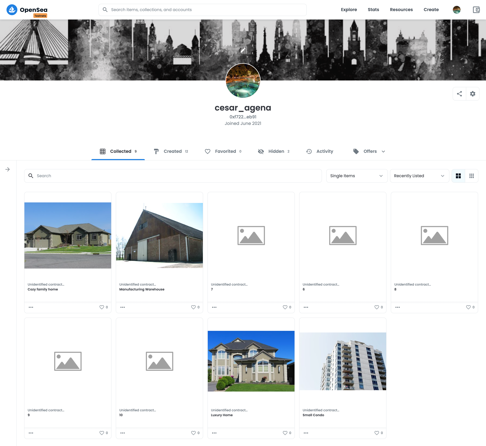

Real Estate Market - Blockchain course capstone project
=======
This is the capstone project for the Blockchain Nanodegree. In this project we build a decentralized application  based on the  ERC-721 Non-Fungible Token Standard Contract. 
Each NFT represents the title of a property. Before minting a token the owner needs to verify they own the property by using a zk-SNARKs based contract.

## Deployment and Testing
In order to test the project follow the instructions:
1. Clone the project and run: `npm install`
2. In the `eth-contracts` folder compile the contracts:  `truffle compile`
3. To run unit tests: `truflle develop` and then `test`
3. Edit `truffle-config.js`
```
    22:  const mnemonic = ""; // type your wallet secret phrase
```
4. Migrate/deploy the contract into the Rinkeby test net: `truffle migrate --network rinkeby`
5. Mint tokens (I did it via [`https://www.myetherwallet.com/`](https://www.myetherwallet.com/) following this tutorial [`https://www.youtube.com/watch?v=8MChn-NJJB0`](https://www.youtube.com/watch?v=8MChn-NJJB0))
6. Create a space in OpenSea testnets passing the contract address. You will be able to see the list of properties containing names, images and some info if you mint tokens with tokenId 1 to 5.
7. From another account you can buy the NFT's making an offer or paying the minimum amount set for the property.

## Contract Deployment
### Rinkeby Contract Address
`0x779E87F6AD2ed95661acB7b07DFB75205c1C3aB7`

### Contract Owner Address (also NFT's owner)
`0xF722D24a94c5576b280A4ED57726A5659ECaEb91`

### Buyer's Address
`0x27f4589960Cc5777Aaa4b27f86075b865Ca5BC58`

### Rinkeby transactions - etherscan
[`https://rinkeby.etherscan.io/address/0x779e87f6ad2ed95661acb7b07dfb75205c1c3ab7`](https://rinkeby.etherscan.io/address/0x779e87f6ad2ed95661acb7b07dfb75205c1c3ab7)


### OpenSea MarketPlace Storefront 
[`https://testnets.opensea.io/cesar_agena`](https://testnets.opensea.io/cesar_agena)



### Contract abi
```
[
    {
      "inputs": [
        {
          "internalType": "address",
          "name": "verifierContractAddress",
          "type": "address"
        }
      ],
      "payable": false,
      "stateMutability": "nonpayable",
      "type": "constructor"
    },
    {
      "anonymous": false,
      "inputs": [
        {
          "indexed": true,
          "internalType": "address",
          "name": "owner",
          "type": "address"
        },
        {
          "indexed": true,
          "internalType": "address",
          "name": "approved",
          "type": "address"
        },
        {
          "indexed": true,
          "internalType": "uint256",
          "name": "tokenId",
          "type": "uint256"
        }
      ],
      "name": "Approval",
      "type": "event"
    },
    {
      "anonymous": false,
      "inputs": [
        {
          "indexed": true,
          "internalType": "address",
          "name": "owner",
          "type": "address"
        },
        {
          "indexed": true,
          "internalType": "address",
          "name": "operator",
          "type": "address"
        },
        {
          "indexed": false,
          "internalType": "bool",
          "name": "approved",
          "type": "bool"
        }
      ],
      "name": "ApprovalForAll",
      "type": "event"
    },
    {
      "anonymous": false,
      "inputs": [
        {
          "indexed": false,
          "internalType": "address",
          "name": "newOwner",
          "type": "address"
        }
      ],
      "name": "OwnershipTransfered",
      "type": "event"
    },
    {
      "anonymous": false,
      "inputs": [
        {
          "indexed": false,
          "internalType": "address",
          "name": "caller",
          "type": "address"
        }
      ],
      "name": "Paused",
      "type": "event"
    },
    {
      "anonymous": false,
      "inputs": [
        {
          "indexed": false,
          "internalType": "uint256",
          "name": "",
          "type": "uint256"
        },
        {
          "indexed": false,
          "internalType": "address",
          "name": "",
          "type": "address"
        }
      ],
      "name": "SolutionAdded",
      "type": "event"
    },
    {
      "anonymous": false,
      "inputs": [
        {
          "indexed": true,
          "internalType": "address",
          "name": "from",
          "type": "address"
        },
        {
          "indexed": true,
          "internalType": "address",
          "name": "to",
          "type": "address"
        },
        {
          "indexed": true,
          "internalType": "uint256",
          "name": "tokenId",
          "type": "uint256"
        }
      ],
      "name": "Transfer",
      "type": "event"
    },
    {
      "anonymous": false,
      "inputs": [
        {
          "indexed": false,
          "internalType": "address",
          "name": "caller",
          "type": "address"
        }
      ],
      "name": "Unpaused",
      "type": "event"
    },
    {
      "constant": false,
      "inputs": [
        {
          "internalType": "bytes32",
          "name": "_myid",
          "type": "bytes32"
        },
        {
          "internalType": "string",
          "name": "_result",
          "type": "string"
        }
      ],
      "name": "__callback",
      "outputs": [],
      "payable": false,
      "stateMutability": "nonpayable",
      "type": "function"
    },
    {
      "constant": false,
      "inputs": [
        {
          "internalType": "bytes32",
          "name": "_myid",
          "type": "bytes32"
        },
        {
          "internalType": "string",
          "name": "_result",
          "type": "string"
        },
        {
          "internalType": "bytes",
          "name": "_proof",
          "type": "bytes"
        }
      ],
      "name": "__callback",
      "outputs": [],
      "payable": false,
      "stateMutability": "nonpayable",
      "type": "function"
    },
    {
      "constant": false,
      "inputs": [
        {
          "internalType": "address",
          "name": "to",
          "type": "address"
        },
        {
          "internalType": "uint256",
          "name": "tokenId",
          "type": "uint256"
        }
      ],
      "name": "approve",
      "outputs": [],
      "payable": false,
      "stateMutability": "nonpayable",
      "type": "function"
    },
    {
      "constant": true,
      "inputs": [
        {
          "internalType": "address",
          "name": "owner",
          "type": "address"
        }
      ],
      "name": "balanceOf",
      "outputs": [
        {
          "internalType": "uint256",
          "name": "",
          "type": "uint256"
        }
      ],
      "payable": false,
      "stateMutability": "view",
      "type": "function"
    },
    {
      "constant": true,
      "inputs": [
        {
          "internalType": "uint256",
          "name": "tokenId",
          "type": "uint256"
        }
      ],
      "name": "getApproved",
      "outputs": [
        {
          "internalType": "address",
          "name": "",
          "type": "address"
        }
      ],
      "payable": false,
      "stateMutability": "view",
      "type": "function"
    },
    {
      "constant": true,
      "inputs": [],
      "name": "getBaseTokenURI",
      "outputs": [
        {
          "internalType": "string",
          "name": "",
          "type": "string"
        }
      ],
      "payable": false,
      "stateMutability": "view",
      "type": "function"
    },
    {
      "constant": true,
      "inputs": [],
      "name": "getName",
      "outputs": [
        {
          "internalType": "string",
          "name": "",
          "type": "string"
        }
      ],
      "payable": false,
      "stateMutability": "view",
      "type": "function"
    },
    {
      "constant": true,
      "inputs": [],
      "name": "getOwner",
      "outputs": [
        {
          "internalType": "address",
          "name": "",
          "type": "address"
        }
      ],
      "payable": false,
      "stateMutability": "view",
      "type": "function"
    },
    {
      "constant": true,
      "inputs": [],
      "name": "getSymbol",
      "outputs": [
        {
          "internalType": "string",
          "name": "",
          "type": "string"
        }
      ],
      "payable": false,
      "stateMutability": "view",
      "type": "function"
    },
    {
      "constant": true,
      "inputs": [
        {
          "internalType": "address",
          "name": "owner",
          "type": "address"
        },
        {
          "internalType": "address",
          "name": "operator",
          "type": "address"
        }
      ],
      "name": "isApprovedForAll",
      "outputs": [
        {
          "internalType": "bool",
          "name": "",
          "type": "bool"
        }
      ],
      "payable": false,
      "stateMutability": "view",
      "type": "function"
    },
    {
      "constant": false,
      "inputs": [
        {
          "internalType": "address",
          "name": "to",
          "type": "address"
        },
        {
          "internalType": "uint256",
          "name": "tokenId",
          "type": "uint256"
        }
      ],
      "name": "mint",
      "outputs": [
        {
          "internalType": "bool",
          "name": "",
          "type": "bool"
        }
      ],
      "payable": false,
      "stateMutability": "nonpayable",
      "type": "function"
    },
    {
      "constant": true,
      "inputs": [
        {
          "internalType": "uint256",
          "name": "tokenId",
          "type": "uint256"
        }
      ],
      "name": "ownerOf",
      "outputs": [
        {
          "internalType": "address",
          "name": "",
          "type": "address"
        }
      ],
      "payable": false,
      "stateMutability": "view",
      "type": "function"
    },
    {
      "constant": false,
      "inputs": [
        {
          "internalType": "address",
          "name": "from",
          "type": "address"
        },
        {
          "internalType": "address",
          "name": "to",
          "type": "address"
        },
        {
          "internalType": "uint256",
          "name": "tokenId",
          "type": "uint256"
        }
      ],
      "name": "safeTransferFrom",
      "outputs": [],
      "payable": false,
      "stateMutability": "nonpayable",
      "type": "function"
    },
    {
      "constant": false,
      "inputs": [
        {
          "internalType": "address",
          "name": "from",
          "type": "address"
        },
        {
          "internalType": "address",
          "name": "to",
          "type": "address"
        },
        {
          "internalType": "uint256",
          "name": "tokenId",
          "type": "uint256"
        },
        {
          "internalType": "bytes",
          "name": "_data",
          "type": "bytes"
        }
      ],
      "name": "safeTransferFrom",
      "outputs": [],
      "payable": false,
      "stateMutability": "nonpayable",
      "type": "function"
    },
    {
      "constant": false,
      "inputs": [
        {
          "internalType": "address",
          "name": "to",
          "type": "address"
        },
        {
          "internalType": "bool",
          "name": "approved",
          "type": "bool"
        }
      ],
      "name": "setApprovalForAll",
      "outputs": [],
      "payable": false,
      "stateMutability": "nonpayable",
      "type": "function"
    },
    {
      "constant": false,
      "inputs": [
        {
          "internalType": "bool",
          "name": "value",
          "type": "bool"
        }
      ],
      "name": "setPause",
      "outputs": [],
      "payable": false,
      "stateMutability": "nonpayable",
      "type": "function"
    },
    {
      "constant": true,
      "inputs": [
        {
          "internalType": "bytes4",
          "name": "interfaceId",
          "type": "bytes4"
        }
      ],
      "name": "supportsInterface",
      "outputs": [
        {
          "internalType": "bool",
          "name": "",
          "type": "bool"
        }
      ],
      "payable": false,
      "stateMutability": "view",
      "type": "function"
    },
    {
      "constant": true,
      "inputs": [
        {
          "internalType": "uint256",
          "name": "index",
          "type": "uint256"
        }
      ],
      "name": "tokenByIndex",
      "outputs": [
        {
          "internalType": "uint256",
          "name": "",
          "type": "uint256"
        }
      ],
      "payable": false,
      "stateMutability": "view",
      "type": "function"
    },
    {
      "constant": true,
      "inputs": [
        {
          "internalType": "address",
          "name": "owner",
          "type": "address"
        },
        {
          "internalType": "uint256",
          "name": "index",
          "type": "uint256"
        }
      ],
      "name": "tokenOfOwnerByIndex",
      "outputs": [
        {
          "internalType": "uint256",
          "name": "",
          "type": "uint256"
        }
      ],
      "payable": false,
      "stateMutability": "view",
      "type": "function"
    },
    {
      "constant": true,
      "inputs": [
        {
          "internalType": "uint256",
          "name": "tokenId",
          "type": "uint256"
        }
      ],
      "name": "tokenURI",
      "outputs": [
        {
          "internalType": "string",
          "name": "",
          "type": "string"
        }
      ],
      "payable": false,
      "stateMutability": "view",
      "type": "function"
    },
    {
      "constant": true,
      "inputs": [],
      "name": "totalSupply",
      "outputs": [
        {
          "internalType": "uint256",
          "name": "",
          "type": "uint256"
        }
      ],
      "payable": false,
      "stateMutability": "view",
      "type": "function"
    },
    {
      "constant": false,
      "inputs": [
        {
          "internalType": "address",
          "name": "from",
          "type": "address"
        },
        {
          "internalType": "address",
          "name": "to",
          "type": "address"
        },
        {
          "internalType": "uint256",
          "name": "tokenId",
          "type": "uint256"
        }
      ],
      "name": "transferFrom",
      "outputs": [],
      "payable": false,
      "stateMutability": "nonpayable",
      "type": "function"
    },
    {
      "constant": false,
      "inputs": [
        {
          "internalType": "address",
          "name": "newOwner",
          "type": "address"
        }
      ],
      "name": "transferOwnership",
      "outputs": [],
      "payable": false,
      "stateMutability": "nonpayable",
      "type": "function"
    },
    {
      "constant": true,
      "inputs": [],
      "name": "getSolutionLength",
      "outputs": [
        {
          "internalType": "uint256",
          "name": "",
          "type": "uint256"
        }
      ],
      "payable": false,
      "stateMutability": "view",
      "type": "function"
    },
    {
      "constant": false,
      "inputs": [
        {
          "internalType": "address",
          "name": "solutionAddress",
          "type": "address"
        }
      ],
      "name": "addSolution",
      "outputs": [
        {
          "internalType": "uint256",
          "name": "",
          "type": "uint256"
        }
      ],
      "payable": false,
      "stateMutability": "nonpayable",
      "type": "function"
    },
    {
      "constant": false,
      "inputs": [
        {
          "internalType": "address",
          "name": "to",
          "type": "address"
        },
        {
          "internalType": "uint256",
          "name": "tokenId",
          "type": "uint256"
        },
        {
          "components": [
            {
              "components": [
                {
                  "internalType": "uint256",
                  "name": "X",
                  "type": "uint256"
                },
                {
                  "internalType": "uint256",
                  "name": "Y",
                  "type": "uint256"
                }
              ],
              "internalType": "struct Pairing.G1Point",
              "name": "a",
              "type": "tuple"
            },
            {
              "components": [
                {
                  "internalType": "uint256[2]",
                  "name": "X",
                  "type": "uint256[2]"
                },
                {
                  "internalType": "uint256[2]",
                  "name": "Y",
                  "type": "uint256[2]"
                }
              ],
              "internalType": "struct Pairing.G2Point",
              "name": "b",
              "type": "tuple"
            },
            {
              "components": [
                {
                  "internalType": "uint256",
                  "name": "X",
                  "type": "uint256"
                },
                {
                  "internalType": "uint256",
                  "name": "Y",
                  "type": "uint256"
                }
              ],
              "internalType": "struct Pairing.G1Point",
              "name": "c",
              "type": "tuple"
            }
          ],
          "internalType": "struct Verifier.Proof",
          "name": "proof",
          "type": "tuple"
        },
        {
          "internalType": "uint256[2]",
          "name": "inputs",
          "type": "uint256[2]"
        }
      ],
      "name": "mintNewNFT",
      "outputs": [],
      "payable": false,
      "stateMutability": "nonpayable",
      "type": "function"
    }
  ]

```
### Deployment log (Rinkeby network)
```
~/Blockchain Nano Degree/capstone/eth-contracts (main) $ truffle migrate --reset --network rinkeby

Compiling your contracts...
===========================
✔ Fetching solc version list from solc-bin. Attempt #1
> Everything is up to date, there is nothing to compile.


Migrations dry-run (simulation)
===============================
> Network name:    'rinkeby-fork'
> Network id:      4
> Block gas limit: 29970705 (0x1c95111)


1_initial_migration.js
======================

   Deploying 'Migrations'
   ----------------------
   > block number:        9494449
   > block timestamp:     1634676332
   > account:             0xF722D24a94c5576b280A4ED57726A5659ECaEb91
   > balance:             10.3787104529931198
   > gas used:            210237 (0x3353d)
   > gas price:           2 gwei
   > value sent:          0 ETH
   > total cost:          0.000420474 ETH

   -------------------------------------
   > Total cost:         0.000420474 ETH


2_deploy_contracts.js
=====================

   Deploying 'Verifier'
   --------------------
   > block number:        9494451
   > block timestamp:     1634676344
   > account:             0xF722D24a94c5576b280A4ED57726A5659ECaEb91
   > balance:             10.3766970389931198
   > gas used:            979344 (0xef190)
   > gas price:           2 gwei
   > value sent:          0 ETH
   > total cost:          0.001958688 ETH


   Deploying 'SolnSquareVerifier'
   ------------------------------
   > block number:        9494452
   > block timestamp:     1634676412
   > account:             0xF722D24a94c5576b280A4ED57726A5659ECaEb91
   > balance:             10.3700250029931198
   > gas used:            3336018 (0x32e752)
   > gas price:           2 gwei
   > value sent:          0 ETH
   > total cost:          0.006672036 ETH

   -------------------------------------
   > Total cost:         0.008630724 ETH


Summary
=======
> Total deployments:   3
> Final cost:          0.009051198 ETH


Starting migrations...
======================
> Network name:    'rinkeby'
> Network id:      4
> Block gas limit: 29941438 (0x1c8debe)


1_initial_migration.js
======================

   Deploying 'Migrations'
   ----------------------
   > transaction hash:    0xb4d7a91ad8d8a099f3ad1c5629e126df57695f6c660d39babfc7b2bab8f14eae
   > Blocks: 2            Seconds: 16
   > contract address:    0x2DFC21Ba04Bee5FAB99E0A09BDF764c5C83b8B9c
   > block number:        9494457
   > block timestamp:     1634676454
   > account:             0xF722D24a94c5576b280A4ED57726A5659ECaEb91
   > balance:             10.37890438999085443
   > gas used:            226537 (0x374e9)
   > gas price:           1.00000001 gwei
   > value sent:          0 ETH
   > total cost:          0.00022653700226537 ETH


   > Saving migration to chain.
   > Saving artifacts
   -------------------------------------
   > Total cost:     0.00022653700226537 ETH


2_deploy_contracts.js
=====================

   Deploying 'Verifier'
   --------------------
   > transaction hash:    0x4b435711a9aad93057c7652671586eea0f7bde98980f4f9871b2f3d4f485e35c
   > Blocks: 0            Seconds: 8
   > contract address:    0x853919274B2C19cDc490ece9194d9ea754b52456
   > block number:        9494459
   > block timestamp:     1634676484
   > account:             0xF722D24a94c5576b280A4ED57726A5659ECaEb91
   > balance:             10.37787928298060336
   > gas used:            979344 (0xef190)
   > gas price:           1.00000001 gwei
   > value sent:          0 ETH
   > total cost:          0.00097934400979344 ETH


   Deploying 'SolnSquareVerifier'
   ------------------------------
   > transaction hash:    0x20394143dafd2013c55499e478354e8260a73473cf1df23aa80f4e62d3137953
   > Blocks: 1            Seconds: 8
   > contract address:    0x779E87F6AD2ed95661acB7b07DFB75205c1C3aB7
   > block number:        9494460
   > block timestamp:     1634676499
   > account:             0xF722D24a94c5576b280A4ED57726A5659ECaEb91
   > balance:             10.37435226494533318
   > gas used:            3527018 (0x35d16a)
   > gas price:           1.00000001 gwei
   > value sent:          0 ETH
   > total cost:          0.00352701803527018 ETH


   > Saving migration to chain.
   > Saving artifacts
   -------------------------------------
   > Total cost:     0.00450636204506362 ETH


Summary
=======
> Total deployments:   3
> Final cost:          0.00473289904732899 ETH
```


